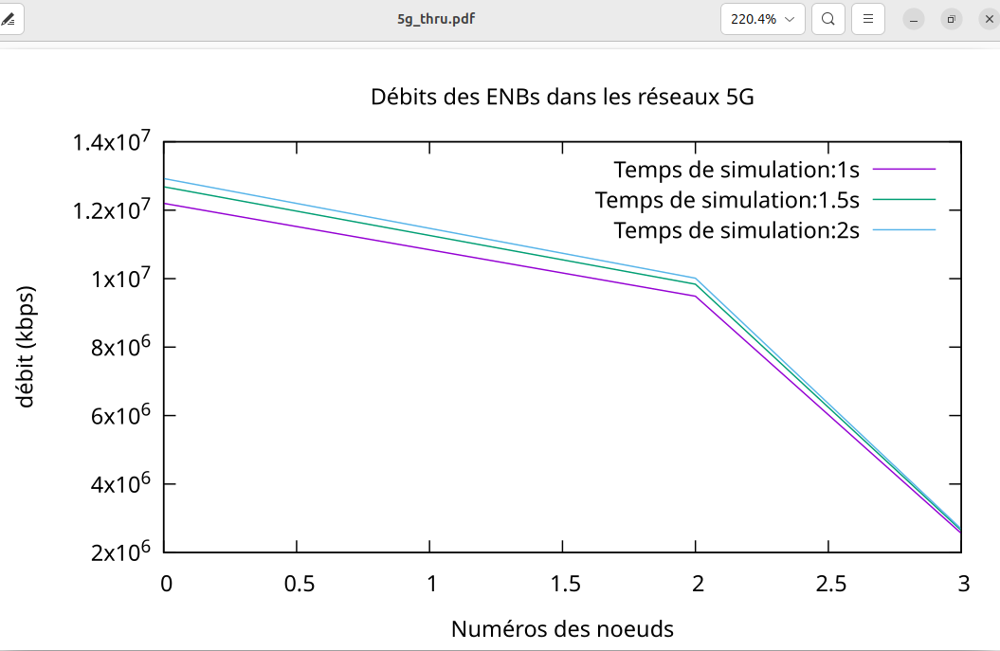
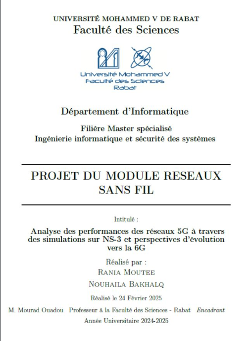

## Contexte du projet

Ce projet a été réalisé dans le cadre du module Réseaux Sans Fil. Il a consisté à étudier les performances des réseaux 5G à travers une approche théorique et pratique, tout en explorant les perspectives d’évolution vers la prochaine génération de réseaux mobiles.

## Partie théorique

L’étude a porté sur les principales caractéristiques techniques de la 5G, notamment le **network slicing**, le **massive MIMO** et le **beamforming**. Ces technologies permettent d’augmenter significativement le débit, de réduire la latence et de supporter une densité plus importante de terminaux connectés.

Une analyse prospective a également été menée sur les innovations envisagées pour la 6G, incluant la communication en **térahertz (THz)**, l’intégration de l’**intelligence artificielle** dans la gestion dynamique des ressources, ainsi que l’apport des **réseaux satellitaires** pour l’extension de la couverture.

## Partie pratique

Le volet expérimental s’est appuyé sur le simulateur **NS-3** afin de modéliser et observer le comportement d’un réseau 5G dans différents scénarios. En ajustant les durées de simulation (1s, 1,5s et 2s), les effets sur le **débit des nœuds** et les **performances globales du réseau** ont pu être mesurés.

Pour enrichir l’analyse :
- **NetAnim** a permis de visualiser les flux d’échange entre les nœuds.
- **TraceMetrics** a extrait des indicateurs de performance détaillés.
- **Gnuplot** a été utilisé pour générer des représentations graphiques exploitables.

## Observations

- Le débit diminue progressivement à mesure que le nombre de nœuds augmente.
- Le temps de simulation a une influence modérée sur les performances globales.
- Une attention particulière doit être portée à l’optimisation des paramètres réseau pour éviter la saturation des nœuds les plus éloignés.

## Conclusion

Ce projet met en évidence l’utilité des outils de simulation pour évaluer, anticiper et adapter les choix techniques dans le cadre de déploiements de réseaux mobiles avancés. Il constitue également un exercice formateur dans la maîtrise des technologies associées à la 5G et à son évolution future.

## Visualisation

 

