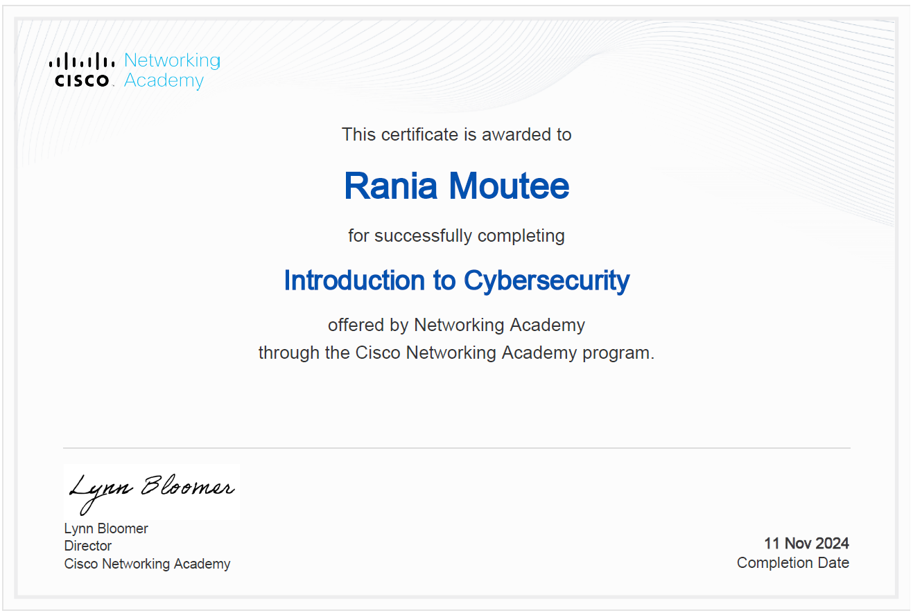
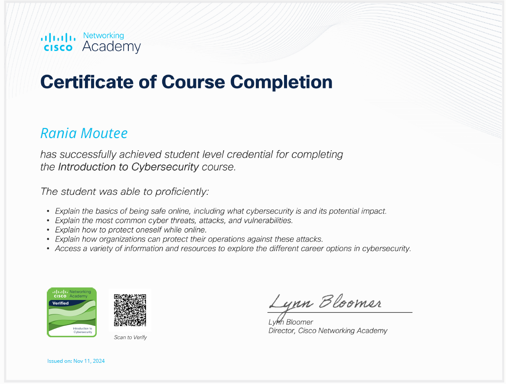
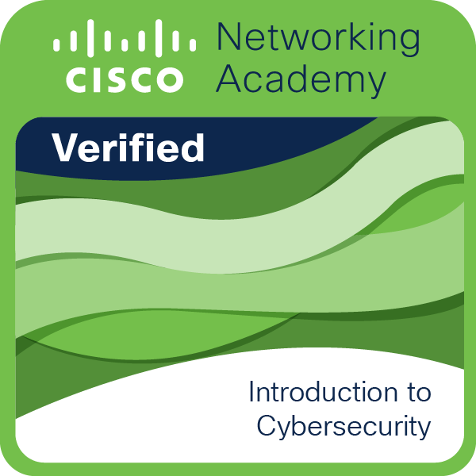

## Cisco Networking Academy – Introduction to Cybersecurity

- **Organisme :** Cisco Networking Academy
- **Niveau :** Student-level credential
- **Date d’obtention :** 11 novembre 2024
- **Badge vérifié :** ✅ Introduction to Cybersecurity – Verified by Cisco

J’ai suivi cette certification **au début de mon Master en cybersécurité**, avec l’objectif de **prendre de l’avance sur les fondamentaux** du domaine et de développer une vision claire des enjeux avant d’aborder les modules avancés du programme.

Cette certification m’a permis de :

- Comprendre ce qu’est la cybersécurité et pourquoi elle est aujourd’hui stratégique dans tous les secteurs.
- Identifier les principales **menaces, attaques, vulnérabilités** et mécanismes de défense.
- Apprendre les bonnes pratiques de **protection individuelle et organisationnelle** en ligne.
- Mieux cerner les **opportunités professionnelles** et les certifications reconnues dans le domaine.

Ce cours a constitué un **point d’entrée solide** pour structurer ma montée en compétences, tout en renforçant ma motivation à m’orienter vers les métiers de l’audit, de la GRC et de la cybersécurité technique.

---

*Certificat vérifié et délivré par Cisco – Networking Academy (ID : 11/11/2024).*
 
