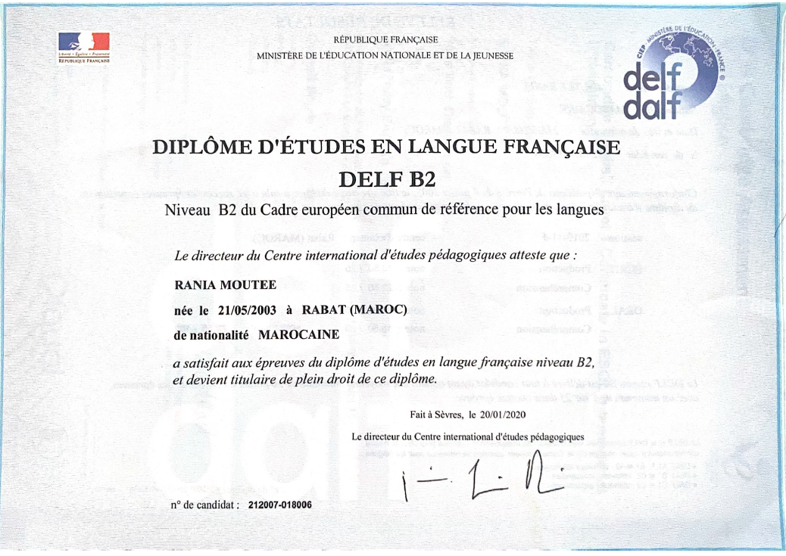

## Diplôme d’Études en Langue Française (DELF B2)

- **Organisme :** Ministère de l’Éducation nationale et de la Jeunesse (France) – CIEP
- **Niveau validé :** B2 (Cadre Européen Commun de Référence pour les Langues)
- **Date d’obtention :** Janvier 2020
- **Lieu d’examen :** Rabat (Maroc)
- **Numéro de candidat :** 212007-018006

Le DELF B2 atteste d’un niveau avancé en compréhension et expression de la langue française, tant à l’oral qu’à l’écrit. Cette certification est reconnue à l’international dans les milieux académiques et professionnels francophones.

Mon niveau de français s’est encore affiné depuis cette certification, notamment à travers mes études universitaires, mes projets rédigés en français et mes interactions en contexte professionnel.

