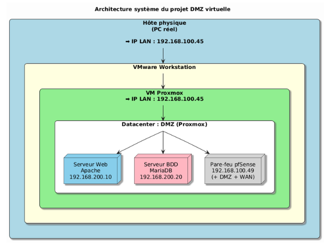
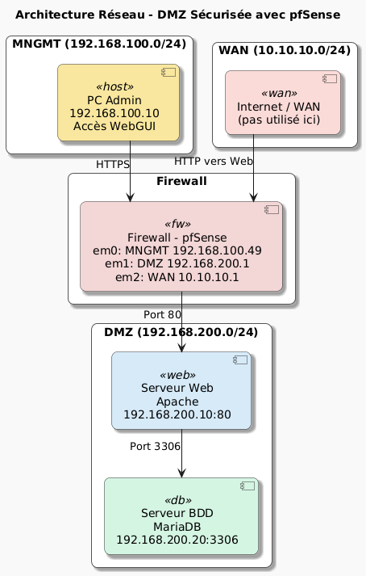

## Contexte du projet

Ce projet s’inscrit dans le cadre du module Cloud Computing et Virtualisation. Il consiste à concevoir un **mini-datacenter virtualisé** incluant une zone démilitarisée (DMZ) fonctionnelle et isolée, hébergeant des services web et base de données, le tout administré par un pare-feu pfSense.

L’environnement a été entièrement déployé dans **Proxmox**, hébergé à l’intérieur de VMware Workstation, avec une configuration réseau structurée en trois sous-réseaux distincts.

## Objectifs

L’objectif est de reproduire une architecture réaliste dans laquelle :
- Les services accessibles depuis l’extérieur sont strictement contrôlés,
- Les flux internes sont cloisonnés selon les principes de sécurité réseau,
- Les échanges sont gérés via des règles explicites configurées dans pfSense.

Cette structure permet de simuler un environnement professionnel conforme aux bonnes pratiques de déploiement sécurisé d’applications en ligne.

## Architecture technique

L’infrastructure repose sur trois réseaux distincts :

- **WAN (10.10.10.0/24)** : simule l’accès Internet.
- **MNGMT (192.168.100.0/24)** : réseau d’administration depuis la machine hôte vers pfSense.
- **DMZ (192.168.200.0/24)** : réseau isolé hébergeant deux machines virtuelles :
  - **Serveur Apache** (Web) : accessible en HTTP depuis Internet.
  - **Serveur MariaDB** (Base de données) : uniquement accessible depuis le serveur web.

Ces composants sont virtualisés dans **Proxmox VE**, avec gestion des ponts réseau (`vmbr0` pour WAN, `vmbr1` pour DMZ/MNGMT), et administrés via une interface dédiée.

## Règles de filtrage configurées dans pfSense

- Accès HTTPS autorisé uniquement entre l’administrateur et pfSense (port d’administration).
- Accès HTTP public au serveur Apache, avec NAT redirigé depuis le WAN.
- Blocage total des connexions entrantes vers le serveur SQL.
- Autorisation stricte des requêtes SQL **uniquement depuis le serveur web vers MariaDB**.
- Isolation complète entre les réseaux WAN, MNGMT et DMZ.

## Technologies et outils utilisés

- **Proxmox VE** : hyperviseur de virtualisation pour l’orchestration des VMs.
- **pfSense** : pare-feu open source, pour la segmentation et la gestion des règles réseau.
- **Apache** : serveur HTTP simulant un service web public.
- **MariaDB** : système de gestion de base de données relationnelle.
- **VMware Workstation** : virtualisation de niveau hôte.
- **Routage NAT, filtrage par zones, DMZ, ponts réseau Linux.**

## Résultat

L’environnement mis en place permet une séparation nette entre les zones publiques et internes. Le **contrôle précis des flux**, la **restriction d’accès à la base de données** et la **cloisonnement réseau via pfSense** démontrent l’intérêt de ce type de configuration pour le déploiement de services exposés de manière sécurisée.

Le projet a également permis de valider le fonctionnement des services, les règles de sécurité appliquées, ainsi que la communication contrôlée entre les composants du datacenter.

## Schéma de l’architecture
  
