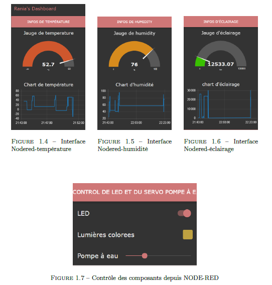
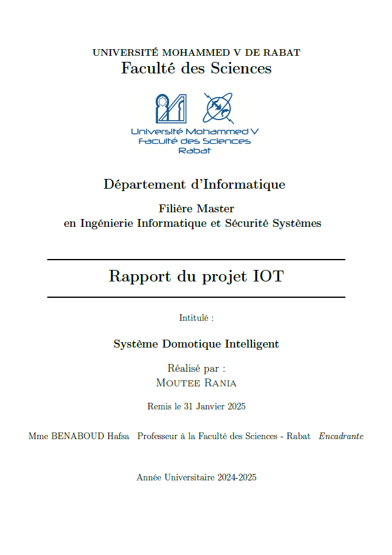

## Contexte du projet

Ce projet a pour objectif la conception et la simulation d’un système domotique capable de surveiller et de contrôler à distance différents paramètres environnementaux. Il repose sur un microcontrôleur **ESP32**, qui centralise les données issues de capteurs et les transmet à des plateformes d’analyse en ligne via les protocoles **MQTT** et **HTTP**.

## Objectifs

L’architecture vise à associer la mesure en temps réel (température, humidité, luminosité, détection de mouvement) à des actions automatiques ou pilotées à distance (activation d’un ventilateur, éclairage, pompe à eau, etc.). L’intégration de plusieurs protocoles permet une meilleure fiabilité de la communication et une centralisation des données à des fins de visualisation ou d’archivage.

## Simulation avec Wokwi

La plateforme **Wokwi** a été utilisée pour simuler l’environnement physique du système, incluant les composants suivants :

- **Capteur DHT22** : mesure température et humidité.  
  - Activation d’une LED bleue (ventilateur) si température > 30°C  
  - Déclenchement d’un buzzer si température > 45°C  
  - Activation d’une LED verte (déshumidificateur) si humidité > 70%

- **Capteur PIR** : détection de présence, avec affichage sur écran **LCD I2C**.

- **Capteur LDR** : mesure de luminosité.  
  - Allumage automatique d’une LED si l’éclairement est < 500 lux.

- **Servomoteur** : simulation d’un système d’arrosage (pompe à eau), pilotable via un **slider Node-RED**.

- **LED Neopixel RGB** : système d’éclairage coloré contrôlable à distance via une interface graphique.

## Interface Node-RED

La plateforme **Node-RED** est utilisée pour le traitement des données envoyées via **MQTT** (serveur HiveMQ) et leur visualisation :

- Affichage en temps réel :
  - Température, humidité, luminosité (jauges et graphiques)
  - Notification de détection de mouvement (alertes)

- Contrôle à distance :
  - Activation/désactivation d’une LED via interrupteur
  - Contrôle du servomoteur via curseur
  - Sélection de couleur pour la LED Neopixel via "color picker"

- Archivage :
  - Enregistrement local des données (timestamp, valeurs) dans un fichier `dataiot.txt` via un nœud de type `write file`.

## Intégration avec ThingSpeak

Les données environnementales sont également envoyées vers la plateforme **ThingSpeak** via **HTTP**. Un canal dédié a été configuré avec 4 champs pour stocker :
- Température
- Humidité
- Présence détectée
- Éclairage

Les courbes de suivi sont mises à jour en temps réel, offrant un aperçu global du comportement du système dans le temps.

## Résultat

Le système permet une surveillance continue et un contrôle précis à distance des composants simulés. La double transmission des données (MQTT + HTTP), associée à une interface graphique interactive, permet de valider une architecture complète, robuste et facilement extensible.

## Visualisation
 

