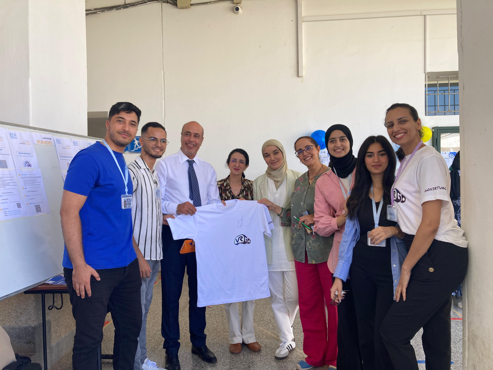
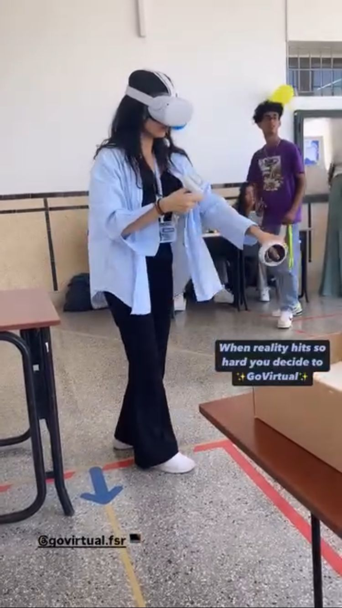
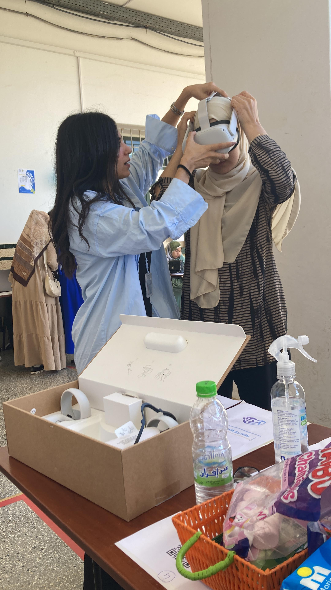

## Contexte de l’initiative

GoVirtual est le **premier club universitaire de réalité virtuelle** fondé à la Faculté des Sciences de Rabat. Il a été créé dans le but de **démocratiser les technologies immersives**, d’explorer des usages innovants de la réalité virtuelle (RV) dans divers domaines (enseignement, santé, divertissement, etc.), et de développer un espace collaboratif pour les étudiant·e·s passionné·e·s de technologies émergentes.

En tant que **membre fondatrice** du club, j’ai intégré le **bureau exécutif** composé de cinq personnes, où j’ai occupé le rôle de **trésorière**.

## Mon rôle de trésorière

Ce poste m’a permis de :
- Gérer les ressources financières du club avec rigueur.
- Participer à la rédaction des demandes de financement.
- Organiser les dépenses liées aux événements (matériel, communication, logistique).
- Développer un **sens des responsabilités**, de la **transparence**, et une gestion proactive des priorités.

Ce rôle a aussi renforcé mes capacités à collaborer avec des profils variés dans un cadre associatif structuré.

## Semaine d’intégration : animation et immersion

Lors de la **semaine d’intégration universitaire**, nous avons animé un stand interactif pour faire connaître GoVirtual et attirer de nouveaux membres. Nous avons permis aux étudiant·e·s de vivre une **expérience immersive avec des casques VR**, ce qui a suscité beaucoup d’intérêt et d’échanges.

J’ai ainsi eu l’opportunité de :
- Interagir avec un large public, ce qui a **développé mes compétences relationnelles**.
- Représenter le club auprès de figures importantes de l’établissement, dont le **Doyen** et la **Vice-Doyenne** de la faculté.
- Adapter mon discours en fonction des profils rencontrés (étudiants, enseignants, administratifs).

Cette expérience m’a permis de **gagner en aisance à l’oral**, de renforcer ma **confiance en moi** et de pratiquer une **communication positive et fédératrice**, autant d’atouts précieux dans un environnement professionnel.

## Impact et perspectives

Participer à la création de GoVirtual a été une expérience marquante. Elle m’a permis de :
- M’investir dans un projet collectif porteur de sens.
- Me positionner en tant qu’actrice de l’innovation au sein de mon université.
- M’ouvrir à une **veille technologique constante**.

## Galerie

  
 
