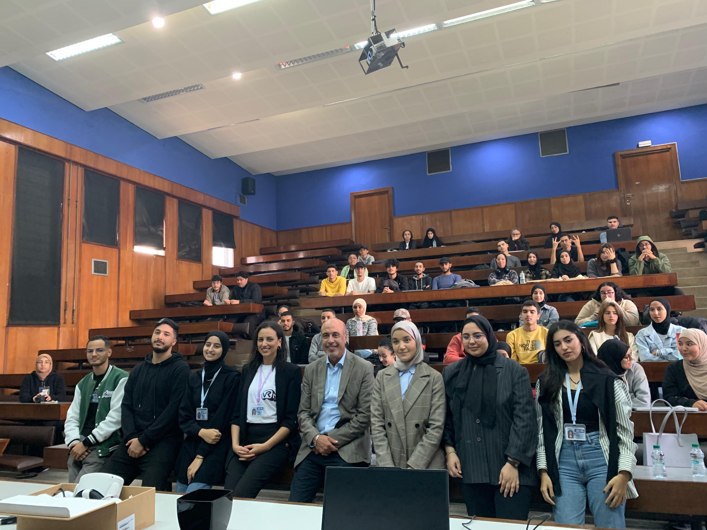
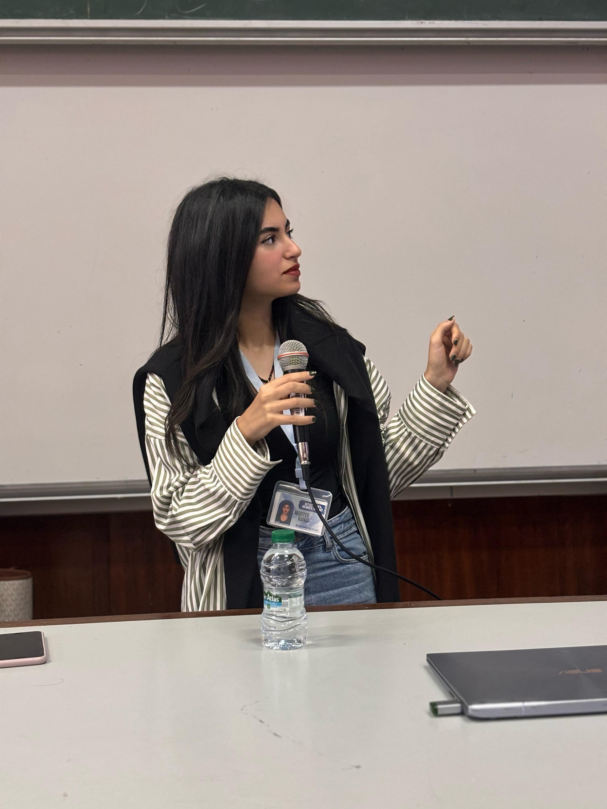
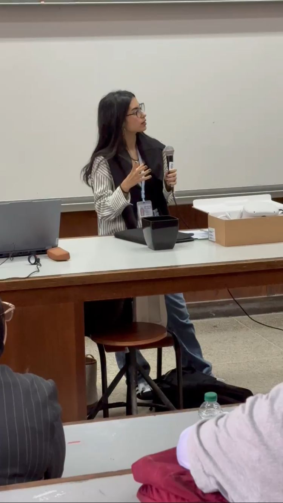
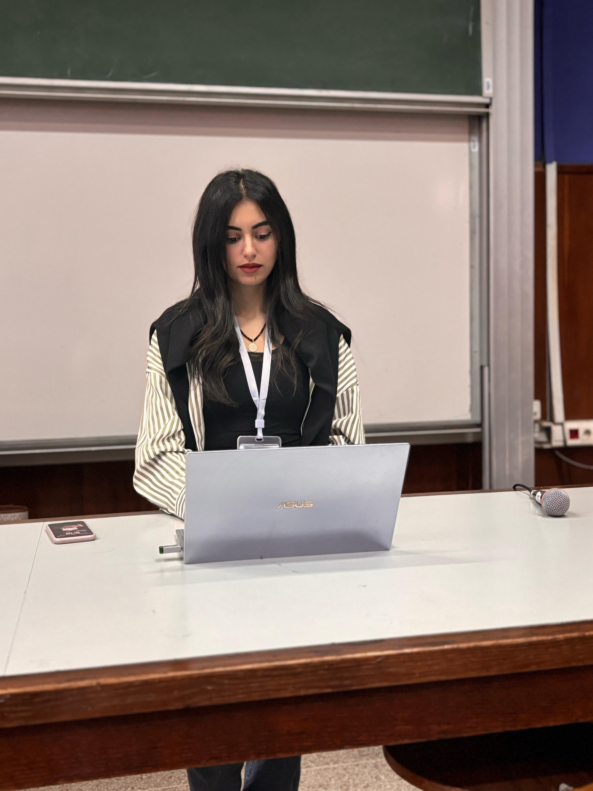

## Une première rencontre marquante

Le 2 novembre 2024, nous avons organisé le tout premier événement du club **GoVirtual** à la Faculté des Sciences de Rabat, intitulé *Découverte de la Réalité Virtuelle : Initiez-vous à la création*. Ce moment a marqué le lancement officiel de notre initiative, avec pour objectif de faire découvrir aux étudiants les possibilités fascinantes offertes par la réalité virtuelle et les outils de création immersive.

Après une présentation de notre mission, de notre vision et des projets à venir, les participants ont pu s’initier concrètement à **Unity** et **Blender** à travers un atelier interactif. Les échanges ont été nombreux, curieux, dynamiques.

## Une expérience humaine et formatrice

En tant que **trésorière du club et co-organisatrice de l’événement**, j’ai eu la chance de prendre la parole pour présenter notre démarche devant un **amphithéâtre rempli d’étudiants**, mais aussi en présence du **Doyen** et de plusieurs **enseignants de la faculté**. Ce moment m’a beaucoup apporté, tant sur le plan personnel que relationnel.

Préparer et mener à bien cet événement m’a permis de :

- M’exprimer avec clarté et assurance devant un public diversifié,
- Renforcer ma capacité à travailler en équipe autour d’un objectif commun,
- Structurer un événement pédagogique de A à Z,
- Créer du lien avec des étudiants issus de différentes filières,
- Et surtout, porter un projet auquel je crois avec conviction.

## Une porte ouverte vers l’innovation

Ce premier événement nous a permis de poser les bases d’une communauté autour de la réalité virtuelle, et d’inspirer de nouveaux membres à nous rejoindre. Il a aussi confirmé mon envie de m’investir dans des projets concrets à la croisée de la **tech**, de la **création** et de la **transmission**.

## Galerie
  
     
