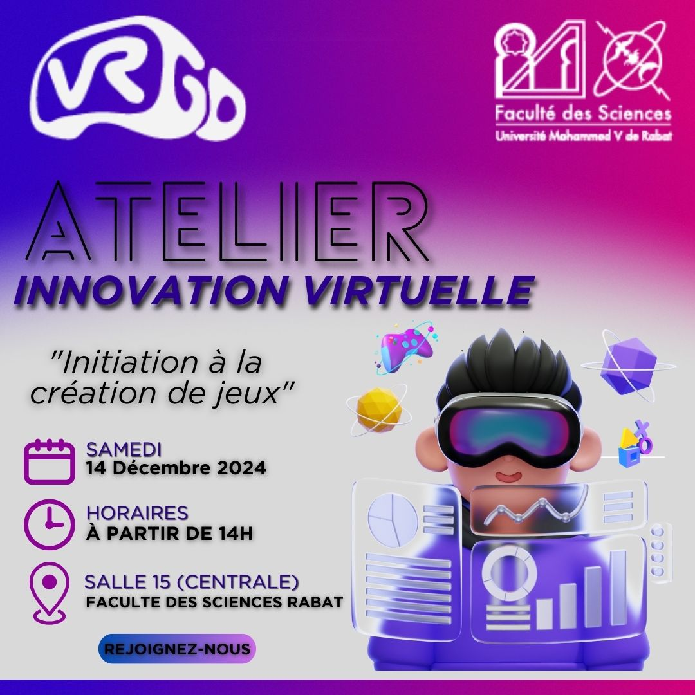
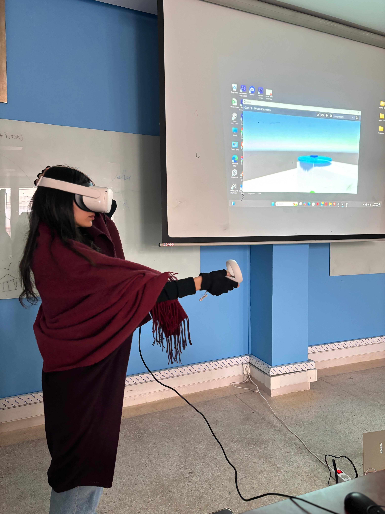
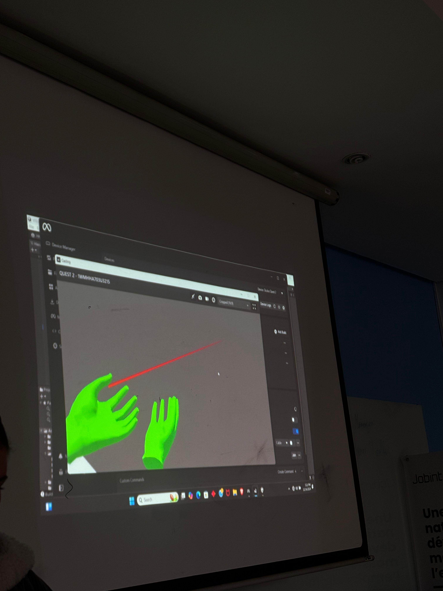
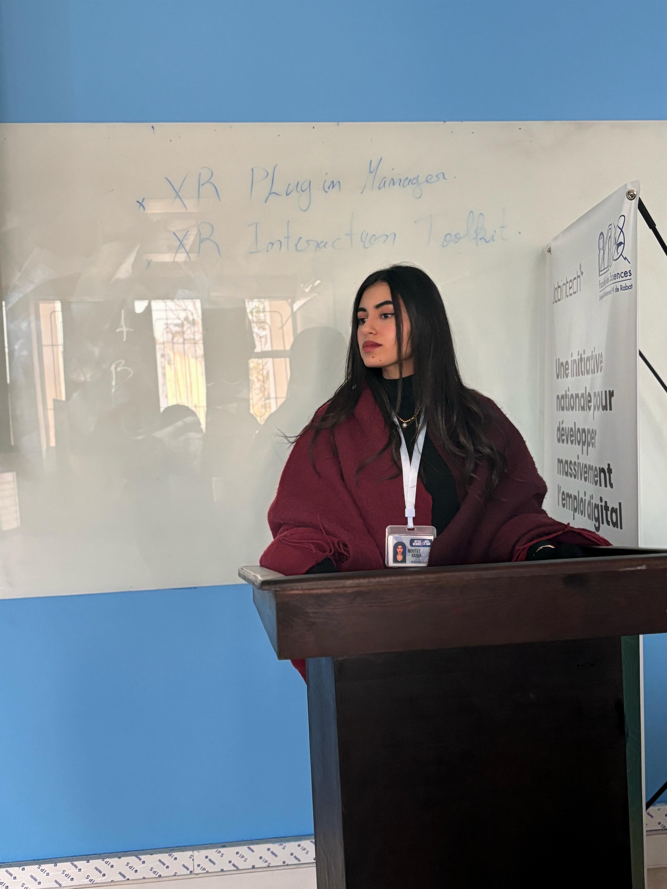
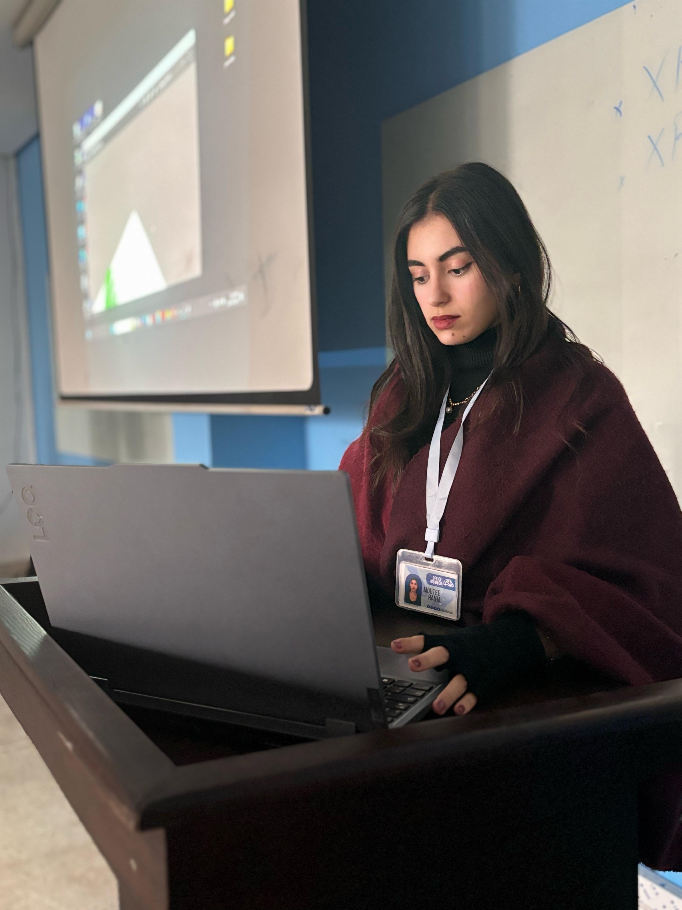
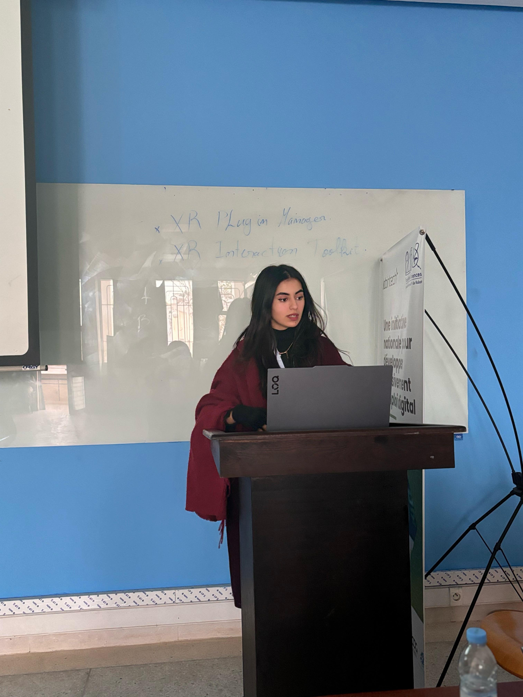
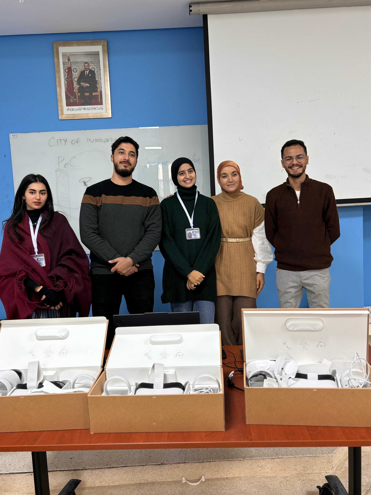

## Contexte de l'événement

Le 14 décembre 2024, le club GoVirtual a organisé son **deuxième événement** intitulé *"Atelier Innovation Virtuelle : Initiation à la création de jeux"*. Cet atelier s’adressait à un public plus ciblé, motivé par l’envie de comprendre les fondements techniques nécessaires à la conception de contenus immersifs.

J'ai eu l'opportunité d'animer cet atelier en introduisant les participants aux **bases indispensables de la création de jeux en réalité virtuelle** : configuration de l’environnement de travail (Unity, XR plugins, Interaction Toolkit), structure d’un projet immersif, gestion des interactions utilisateur, etc. Pour appuyer mes explications, j’ai mené des démonstrations concrètes à l’aide de **casques Meta Quest**, dont le contenu était projeté en direct via **datashow**, favorisant ainsi une compréhension collective.

## Une expérience formatrice à plusieurs niveaux

Prendre la parole devant un groupe d’étudiants passionnés a renforcé ma capacité à **structurer et transmettre des connaissances techniques**, tout en m’adaptant à des profils hétérogènes. J’ai aussi appris à gérer le rythme d’une session pédagogique, à anticiper les points de blocage et à maintenir un climat bienveillant favorisant l’échange.

Cette expérience m’a permis de développer plusieurs compétences, notamment :

- **Pédagogie et vulgarisation technique**
- **Esprit de leadership et gestion d’atelier**
- **Clarté dans la communication orale**
- **Capacité à inspirer et motiver un groupe**

Enfin, la rencontre et l’échange avec notre professeur mentor à la fin de l’événement ont été l’occasion d’évaluer l’impact de nos actions et de préparer les prochaines initiatives du club.

## Galerie

 
 
 

