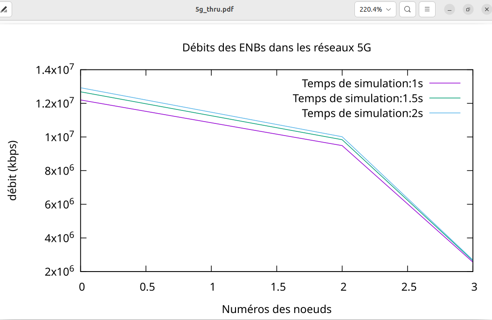
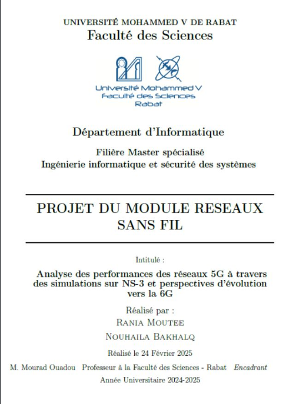

## Detailed description
Dans le cadre du module Réseaux Sans Fil, j’ai eu le plaisir de réaliser ce projet avec mon binôme nouhaila bakhalq. Nous avons exploré les performances des réseaux 5G et leurs perspectives d’évolution vers la 6G.

📌 Partie théorique :
 L’étude met en avant les caractéristiques avancées de la 5G, telles que le network slicing, le massive MIMO et le beamforming, qui améliorent la vitesse, la latence et la densité de connexion. Elle analyse également les innovations qui façonneront la 6G, notamment la communication THz, l’intelligence artificielle et l’intégration des satellites.

🔬 Partie pratique :
Les simulations jouent un rôle clé dans l’analyse et l’optimisation des réseaux de télécommunications. Elles permettent d’évaluer les performances, d’anticiper les défis et d’optimiser les architectures avant leur déploiement réel.
 Dans ce projet, une simulation sur NS-3 a été mise en place pour observer le comportement des réseaux 5G dans différents scénarios. En faisant varier les temps de simulation (1s, 1.5s, 2s), l’impact sur le débit de transmission des nœuds et les performances globales du réseau a été analysé.

Pour une meilleure interprétation des résultats, NetAnim a permis de visualiser l’échange de données entre les nœuds, tandis que TraceMetrics a extrait des métriques détaillées sur les performances du réseau. Enfin, l’analyse des variations de débit a été réalisée à l’aide de Gnuplot, permettant une représentation graphique des résultats.
📊 Principaux résultats :
 ✅ Une diminution progressive du débit avec l’augmentation du numéro de nœud
 ✅ Un impact modéré du temps de simulation sur les performances globales
 ✅ Une optimisation nécessaire pour éviter la congestion des nœuds éloignés

Cette étude met en évidence l’importance des simulations dans la compréhension et l’amélioration des performances des réseaux mobiles. Elles constituent un outil essentiel pour anticiper les évolutions futures vers la 6G. 

## Result

 

