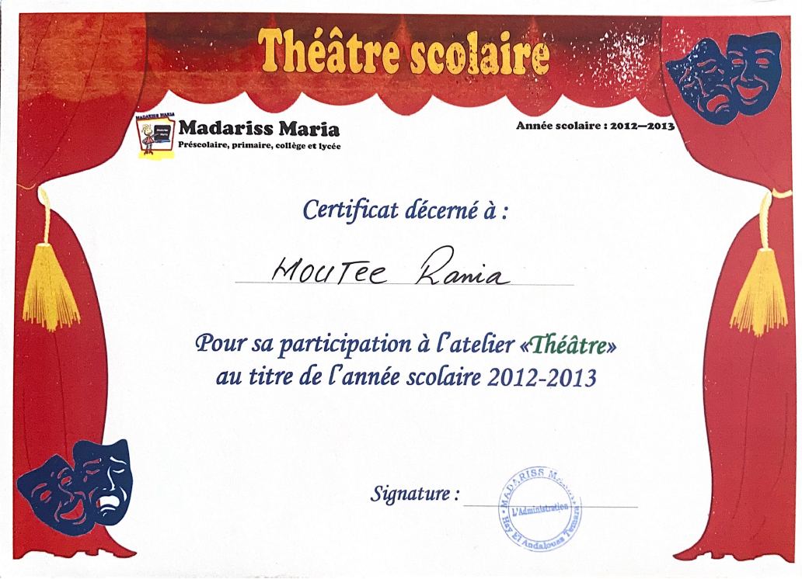
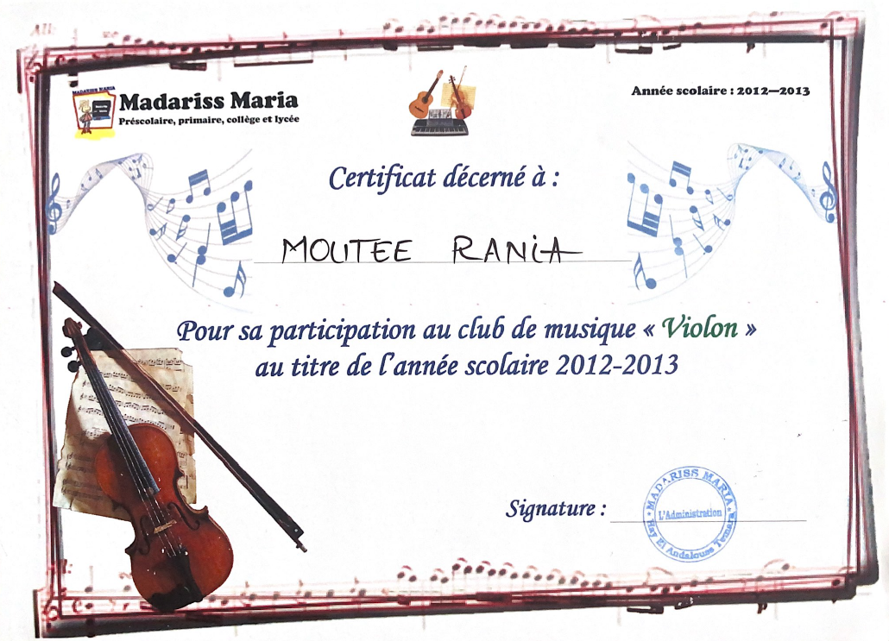

## Un parcours enrichi par la pratique artistique

Depuis mon plus jeune âge, les activités artistiques ont occupé une place essentielle dans ma vie, au-delà du cadre scolaire. Elles m'ont permis d'acquérir des qualités humaines précieuses, en cohérence avec les attentes du monde professionnel.

## Musique : entre discipline et sensibilité

J’ai eu la chance d’intégrer, dès l’école primaire, un club de musique où j’ai pratiqué le **violon** de manière régulière, tout en découvrant également le **piano** et la **flûte**. Ces instruments m’ont appris la rigueur, l’écoute et la coordination, des compétences transférables aujourd’hui dans des environnements de travail collaboratifs et techniques.

## Théâtre : confiance et expression en français comme en anglais

Parallèlement, j’ai participé à plusieurs **clubs de théâtre**, aussi bien en français qu’en anglais. Ces expériences scéniques m’ont aidée à prendre la parole avec assurance, à améliorer mon expression orale, mais surtout à travailler l’empathie, l’adaptation et la présence – autant d’atouts recherchés dans les métiers du conseil et de la gestion des relations humaines en cybersécurité.

## Lecture, écriture, et curiosité intellectuelle

La **lecture** régulière – tant de romans que d’essais – nourrit mon sens de l’analyse, mon vocabulaire, mais aussi ma capacité à synthétiser des idées complexes. L’**écriture** me permet de structurer mes réflexions et d’exprimer ma créativité, notamment dans les rapports de projet ou les restitutions orales.

## Football : esprit d’équipe et inspiration

Passionnée de football, je suis avec enthousiasme les grands championnats européens et particulièrement le parcours du **Liverpool Football Club**, dont les valeurs de combativité, d’unité et de résilience m’inspirent. Même si je le pratique peu, ce sport m’enseigne la **stratégie collective**, la **gestion des efforts dans la durée** et la **capacité à garder la motivation face à l’adversité** – des leçons applicables autant dans les projets que dans le monde professionnel.

## Conclusion

Ces loisirs m’ont permis, dès l’adolescence, de développer une personnalité équilibrée entre rigueur, créativité, aisance relationnelle et capacité d’engagement. Ils complètent mon profil technique et renforcent ma candidature pour des stages dans les domaines de l’**audit**, de la **gouvernance des SI** ou de la **conformité**.

## Attestations

 
