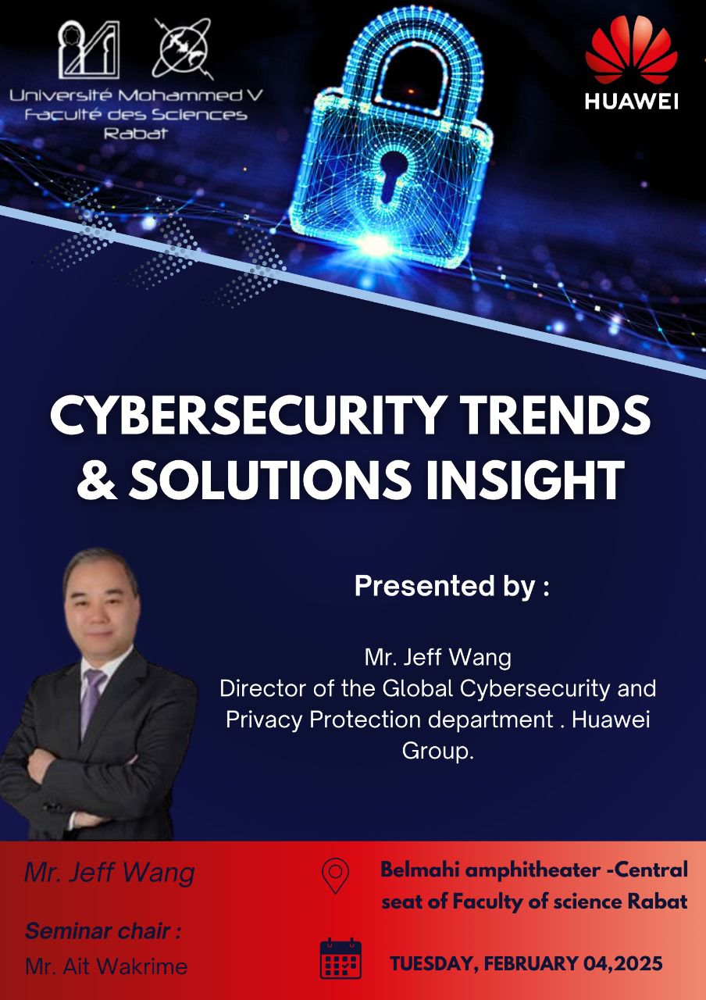
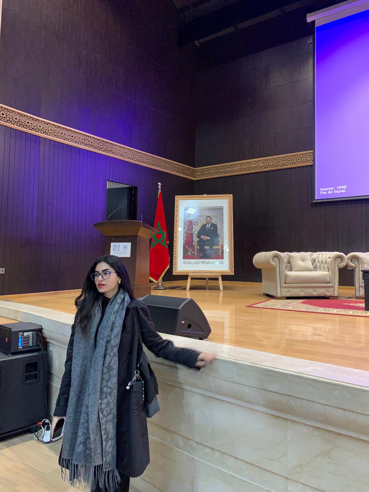
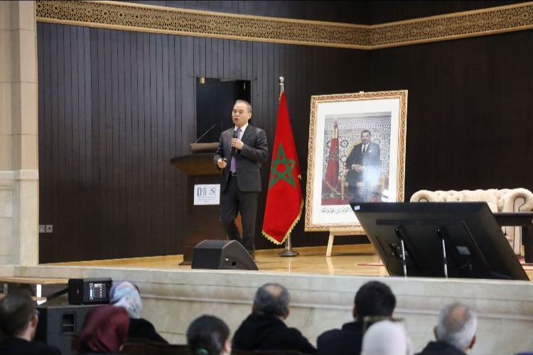
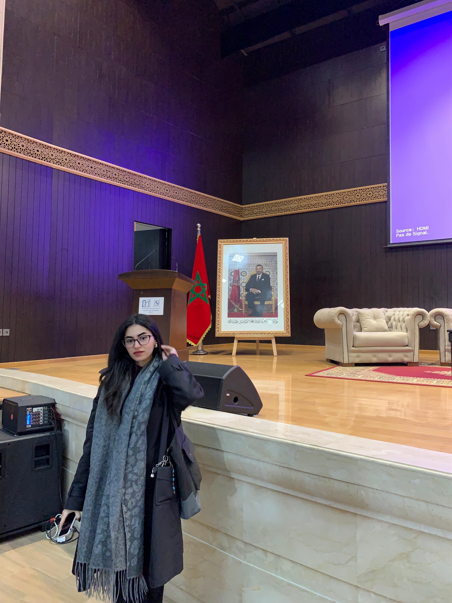
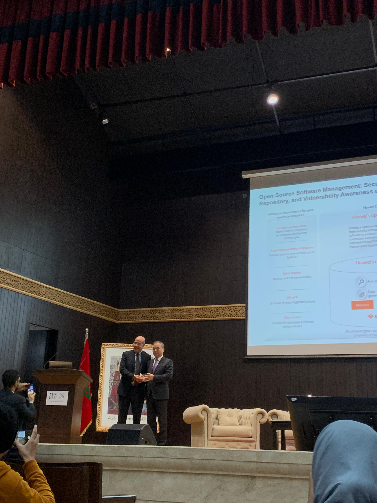

## Contexte de l'événement

Dans le cadre de mon programme de Master en cybersécurité, j’ai eu la chance d’assister au séminaire **"Cybersecurity Trends & Solutions Insight"**, organisé en collaboration entre l’Université Mohammed V de Rabat et **Huawei**. L'événement s’est tenu dans l’amphithéâtre Belmahi et a réuni plusieurs experts de la sécurité numérique.

## Intervenants et thématiques

Parmi les intervenants phares :

- **M. Jeff Wang**, Directeur du département mondial de la cybersécurité et de la protection de la vie privée chez **Huawei Group**, a partagé sa vision sur les enjeux de sécurité à l’ère du numérique.
- **M. Youssef Ait Kaddour**, Chief Cybersecurity Officer chez Huawei Maroc.
- Le **Directeur Delivery & Service de Huawei Maroc** est également intervenu pour discuter des défis opérationnels.

Les discussions ont porté sur :
- Les menaces émergentes en cybersécurité ;
- La sécurisation des logiciels open-source ;
- L’importance des **partenariats académiques-industrie** ;
- Les bonnes pratiques pour renforcer la protection des infrastructures critiques.

## Ce que cette expérience m’a apporté

Cette conférence m’a permis de :

- Mieux comprendre **les tendances actuelles en cybersécurité** à l’échelle internationale ;
- Appréhender l’importance stratégique de la **gestion des vulnérabilités logicielles** ;
- Élargir mes connaissances sur **la gouvernance de la sécurité** au sein des grands groupes ;
- Me sensibiliser aux **standards internationaux en matière de protection de la vie privée** ;
- Renforcer ma culture professionnelle en assistant à des échanges entre experts.

## Impact personnel et professionnel

Participer à ce type d’événements me permet de rester connectée aux **enjeux concrets du secteur**, tout en affinant ma capacité à m’aligner avec les attentes des entreprises. Cela nourrit également mon esprit critique, mon sens de l’analyse stratégique et ma curiosité pour les innovations technologiques.

## Galerie

