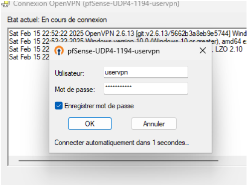
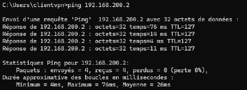

## Project Description
Ce projet consiste à mettre en place une solution permettant un accès externe sécurisé
au réseau de l’entreprise via une connexion VPN OpenVPN. Cette solution reposera sur
un pare-feu pfSense, déployé sous VMware. L’architecture du projet est la suivante :
— Une machine virtuelle pfSense, avec :
1. Une interface WAN (192.168.1.1) du réseau 192.168.1.0/24, connectée à Internet.
2. Une interface LAN (192.168.200.1) représentant le réseau interne de l’entreprise
(192.168.200.0/24)
— Une machine virtuelle Windows 11 UEFI (192.168.200.2) simulant un poste de
travail au sein de l’entreprise.
— Une autre machine virtuelle Windows 11, située hors du réseau de l’entreprise (côté
Internet), qui tentera de se connecter au réseau interne via le VPN OpenVPN.
— La connexion VPN s’établira à travers un tunnel sécurisé utilisant le réseau
10.10.10.0/24, permettant l’accès aux fichiers de la machine virtuelle interne
ainsi que son contrôle à distance.
Cette architecture vise à garantir un accès sécurisé aux ressources internes tout en
assurant un contrôle et un échange de données fiables entre les utilisateurs distants et le
réseau de l’entreprise.
## YouTube video



## Result

 