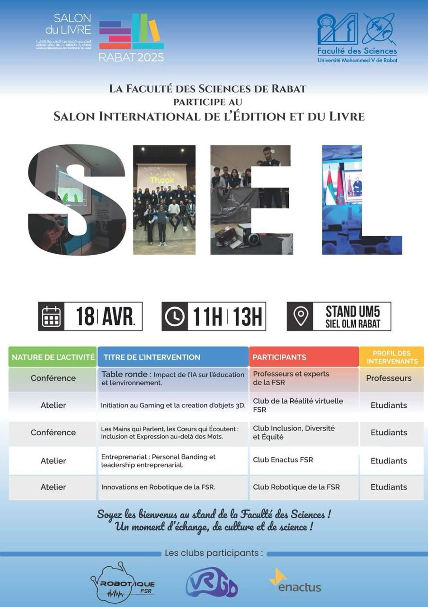
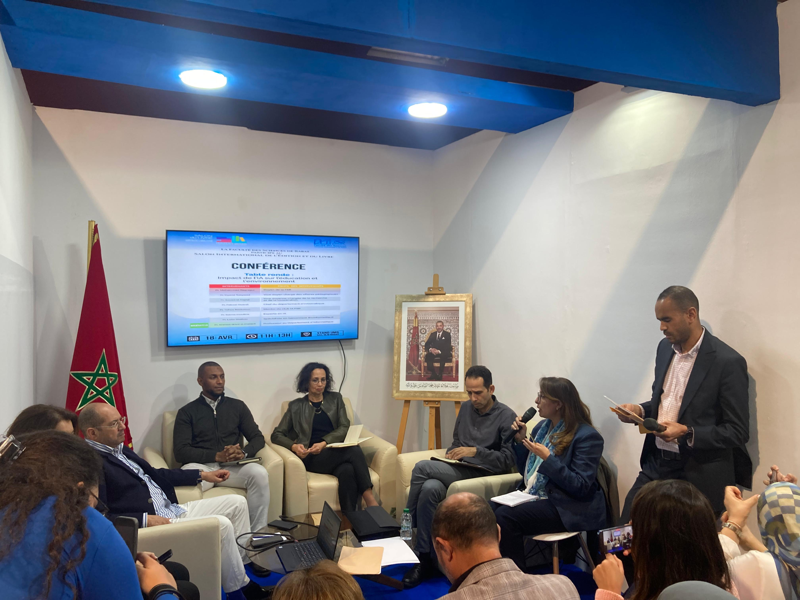
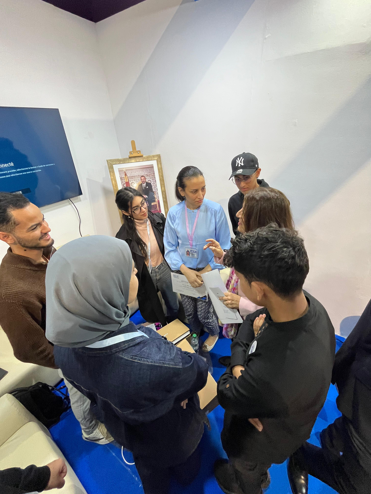
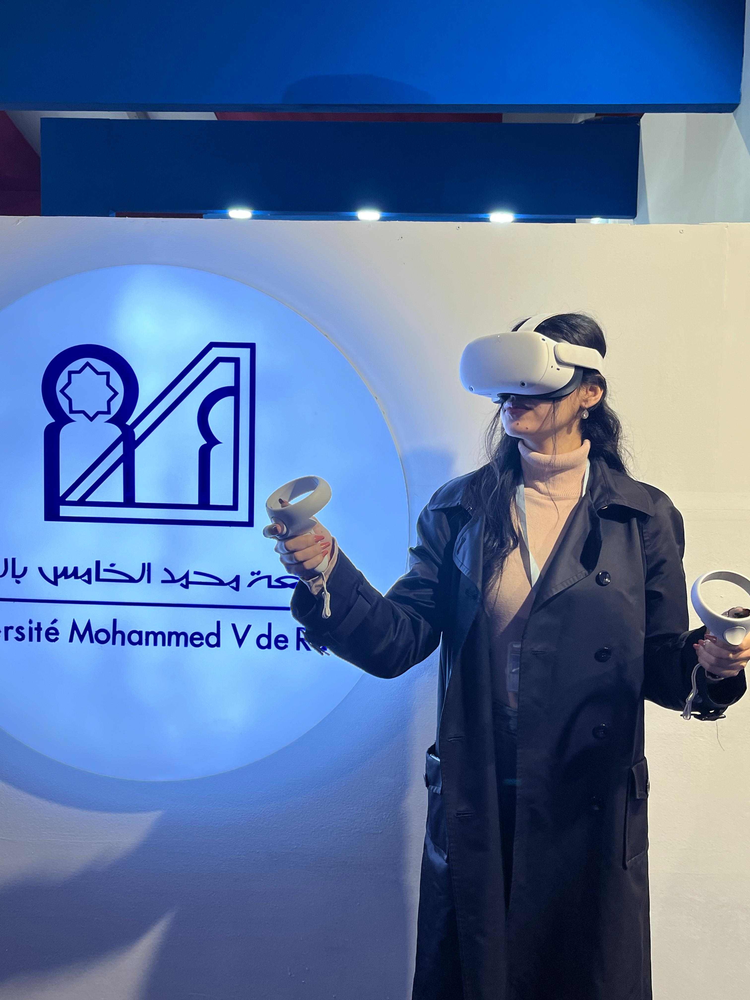
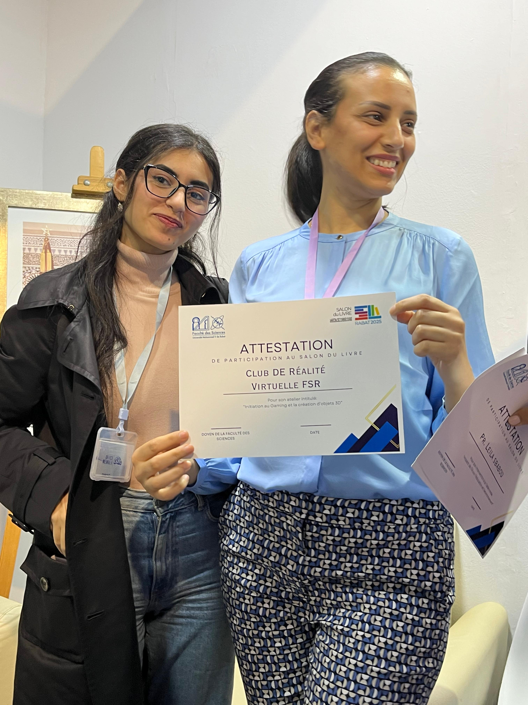

## Présentation de l'événement

Le 18 avril 2025, la Faculté des Sciences de Rabat a pris part au **Salon International de l’Édition et du Livre (SIEL)**, en représentant l’Université Mohammed V au sein du **stand officiel UM5**. En tant que membre actif du **Club de Réalité Virtuelle**, j’ai eu la chance de contribuer à cet événement enrichissant en participant à des démonstrations immersives et en échangeant avec un public diversifié.

## Mon rôle et les activités menées

Notre club a animé un **atelier autour du gaming et de la création 3D**, attirant l’attention de nombreux visiteurs, professionnels et passionnés. En parallèle, j’ai assisté à plusieurs **conférences et tables rondes** axées sur des thématiques variées telles que l’intelligence artificielle, l’inclusion, l’éducation et l’entrepreneuriat.

J’ai eu l’opportunité d’échanger avec des **experts issus de différents domaines**, ce qui a stimulé ma curiosité intellectuelle et nourri ma vision multidisciplinaire des technologies émergentes.

## Compétences développées

Cette expérience m’a permis de renforcer plusieurs compétences :

- 🔹 **Communication professionnelle** : j’ai pu développer ma capacité à présenter un projet technique à un public hétérogène, en adaptant mon discours selon les profils.
- 🔹 **Travail d’équipe et coordination** : intégrer un événement de cette ampleur a nécessité une collaboration fluide avec les autres membres du club et les organisateurs.
- 🔹 **Esprit critique et curiosité sectorielle** : les interventions variées auxquelles j’ai assisté m’ont permis de mieux comprendre l’impact des innovations numériques sur des enjeux sociétaux.
- 🔹 **Capacité d’adaptation** : gérer les imprévus techniques, accueillir des visiteurs variés et rester réactive ont renforcé ma capacité à évoluer dans des environnements dynamiques et exigeants.
- 🔹 **Sens de l'engagement** : représenter son université dans un événement national m’a donné le goût de l’implication institutionnelle et de la responsabilité collective.

## Galerie

