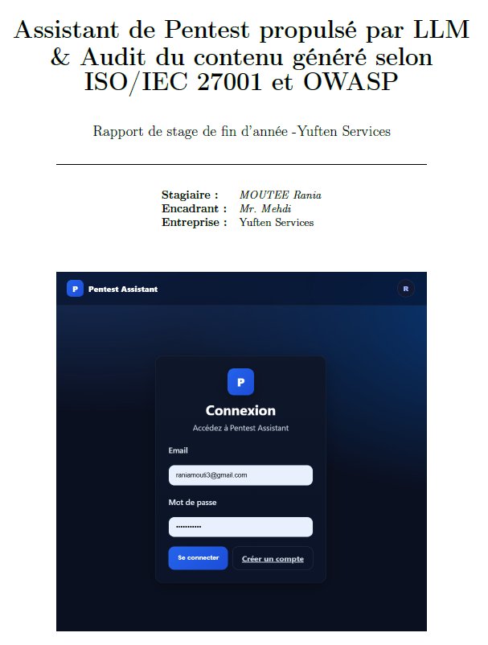
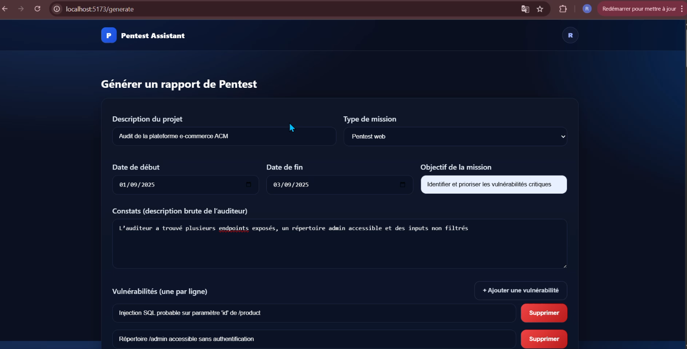

## Contexte du projet

Dans le cadre de mon stage de Master 1 en cybersécurité chez **Yuften Services**, j’ai conçu un **assistant automatisé de génération de rapports de pentest**, reposant sur un modèle de langage (LLM) fonctionnant en local avec **Ollama**.  

L’objectif global est donc de **réduire le temps de production documentaire** tout en assurant une **conformité avec les standards reconnus** (PTES, ISO/IEC 27001, OWASP).

---

## Objectifs

- Réduire significativement le temps nécessaire à la production des rapports.  
- Générer automatiquement des livrables structurés : charte, planning, résumé exécutif, fiches de vulnérabilités.  
- Garantir une **conformité avec ISO/IEC 27001 et OWASP**.  
- Démontrer la faisabilité d’une telle solution dans un environnement limité (ressources locales).  

---

## Architecture du projet

L’application repose sur une architecture en **trois couches** :  

1. **Frontend (React + Vite)**  
   - Formulaire interactif pour la saisie des données (objectifs, vulnérabilités, constats).  
   - Visualisation en **Markdown** (résumé, fiches, rapport global).  
   - Authentification via Firebase.  

2. **Backend (Java / Spring Boot)**  
   - API REST exposant les endpoints de génération (`/api/pentest/generate/all`).  
   - Services internes : `PentestGeneratorService`, `OllamaService`.  
   - Sérialisation JSON avec Jackson.  

3. **Moteur LLM (Ollama + llama3.2:1b)**  
   - Fonctionnement local pour éviter toute fuite de données sensibles.  
   - Génération de contenu textuel à partir des prompts construits par le backend.  

---

## Technologies utilisées

- **Java / Spring Boot** : logique métier et API REST.  
- **React + Vite** : interface utilisateur et rendu dynamique.  
- **Ollama (llama3.2:1b)** : génération automatique de contenu.  
- **Postman** : test des endpoints.  
- **Firebase** : authentification.  
- **Git, IntelliJ IDEA, VS Code** : environnement de développement.  

---

## Résultats obtenus

- **API de génération** opérationnelle, produisant résumé exécutif, planning, rapport global et fiches vulnérabilités.  
- **Frontend fonctionnel** avec rendu Markdown clair et formulaires dynamiques.  
- **Audit du contenu généré** :  
  - Pertinence et lisibilité élevées (notes supérieures à 4/5).  
  - Points faibles : manque de scores CVSS, références normatives et preuves concrètes.  
  - Score global d’environ **66 %** (3,31/5).  

---

## Audit et conformité

- **ISO/IEC 27001** : plusieurs contrôles partiellement couverts (A.9, A.12, A.14), mais lacunes sur la gestion des incidents (A.16) et la traçabilité (A.18).  
- **OWASP** : couverture des vulnérabilités Injection, Broken Access Control et Misconfigurations, mais lacunes sur d’autres familles ASVS.  
- **Recommandations** :  
  - Forcer l’intégration de CVSS, CWE, références ISO.  
  - Ajouter un validateur backend.  
  - Prévoir un système de téléversement de preuves.  

---

## Bilan et perspectives

- **Objectif atteint** : un prototype fonctionnel validant la faisabilité d’un assistant de génération de rapports de pentest basé sur un LLM local.  
- **Perspectives** :  
  - Ajout de post-traitements automatiques (scores CVSS, CWE, ISO).  
  - Intégration d’outils de scan (ZAP, Nmap).  
  - Export standardisé en PDF/DOCX.  
  - Téléversement et gestion de preuves.  

---

## Illustrations

    
  
