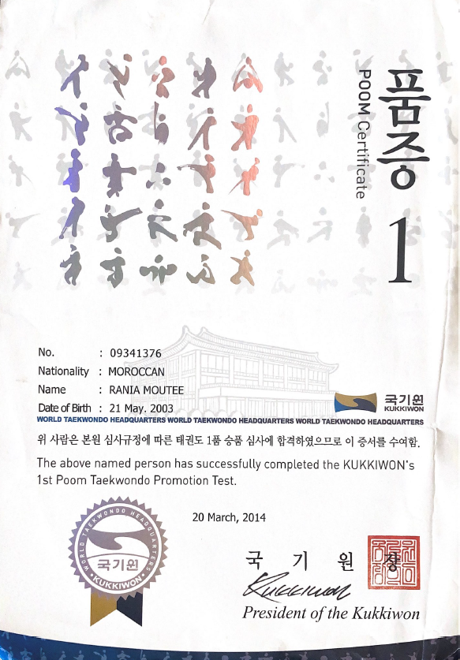
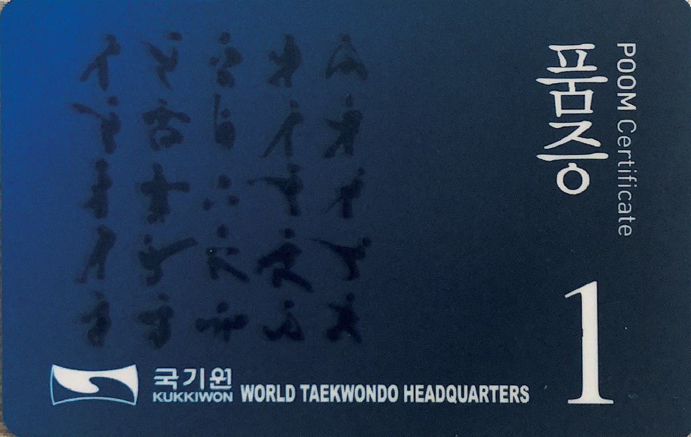
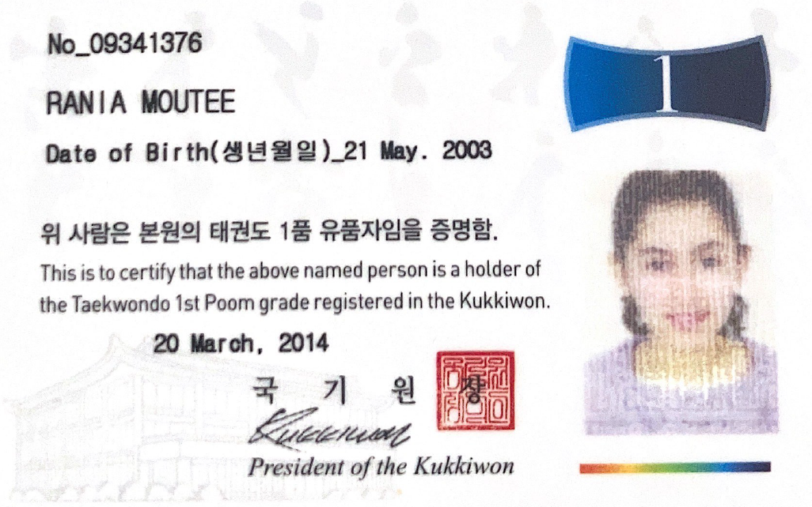
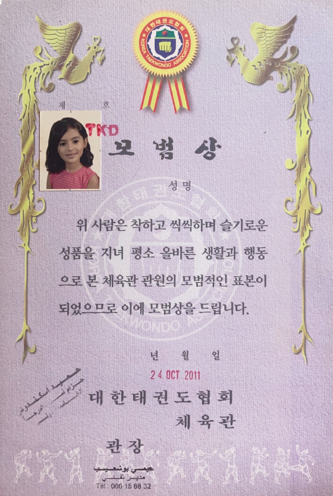

J’ai obtenu ma **ceinture noire (1er Poom)** de **Tae Kwon Do** en **2014**, délivrée par le **Kukkiwon – World Taekwondo Headquarters**, après plusieurs années d'entraînement rigoureux et d'évaluations officielles.

Cette expérience a fortement contribué à structurer ma personnalité et à développer des qualités aujourd’hui recherchées dans le domaine de la **cybersécurité**, notamment en **gouvernance**, **audit des SI** et **gestion des risques** :

- **Discipline** : capacité à suivre une méthodologie stricte et à respecter les règles dans des contextes exigeants.
- **Maîtrise de soi** : gestion du stress et prise de décision réfléchie, y compris sous pression.
- **Persévérance** : volonté d’atteindre ses objectifs même face aux difficultés, qualité essentielle dans les environnements techniques.
- **Éthique et rigueur** : respect des engagements, esprit de justice, sens du devoir.

En 2011, j’ai également été distinguée pour mon comportement exemplaire en club, une reconnaissance qui reflète un engagement constant dans la durée.

---

### Attestations

