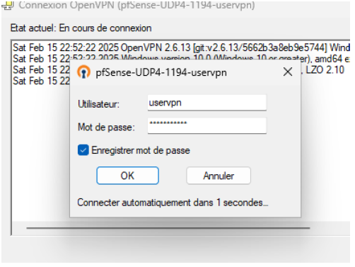

## Contexte du projet

Ce projet s’inscrit dans une démarche de sécurisation des accès distants aux ressources d’un réseau d’entreprise. Il consiste à déployer une solution VPN basée sur OpenVPN, intégrée à un pare-feu pfSense, afin de simuler un environnement dans lequel un utilisateur externe peut accéder de manière fiable et contrôlée à un réseau interne depuis Internet.

## Objectifs

L’objectif principal était de mettre en place une architecture fonctionnelle permettant à un poste distant d’accéder au réseau interne de manière sécurisée, tout en conservant un contrôle précis sur les flux autorisés. Le projet visait également à renforcer la compréhension des mécanismes de tunneling, de gestion d’adresses IP virtuelles, et de configuration d’un pare-feu dans un contexte de mobilité ou de télétravail.

## Architecture mise en place

- **Pare-feu pfSense**, déployé sous VMware :
  - Interface WAN : `192.168.1.1` sur le réseau public `192.168.1.0/24`
  - Interface LAN : `192.168.200.1`, réseau interne de l’entreprise (`192.168.200.0/24`)
- **Machine Windows 11 (192.168.200.2)**, représentant un poste de travail local.
- **Client distant Windows 11**, connecté via Internet, cherchant à accéder au réseau interne.
- **Tunnel VPN OpenVPN**, configuré sur le sous-réseau virtuel `10.10.10.0/24`, utilisé pour établir la communication sécurisée entre le client et le réseau local.

## Technologies utilisées

- OpenVPN (protocole SSL/TLS)
- pfSense (pare-feu open source)
- VMware Workstation
- Réseaux virtuels bridgés et isolés

## Déroulement

Une fois le serveur OpenVPN configuré sur pfSense, un client distant a été mis en place et authentifié à l’aide de certificats générés manuellement. La connexion établie a permis d’accéder aux services internes (ping, partage de fichiers, accès RDP), démontrant l’efficacité de l’architecture déployée. Des règles de filtrage ont été appliquées sur le pare-feu pour affiner les autorisations selon les cas d’usage simulés.

## Résultat

Le projet a permis de valider un cas d’usage réaliste d’accès à distance aux ressources internes d’une organisation. L’infrastructure mise en place assure la confidentialité et l’intégrité des échanges, tout en permettant un contrôle rigoureux sur les communications établies à travers le tunnel VPN.

 

