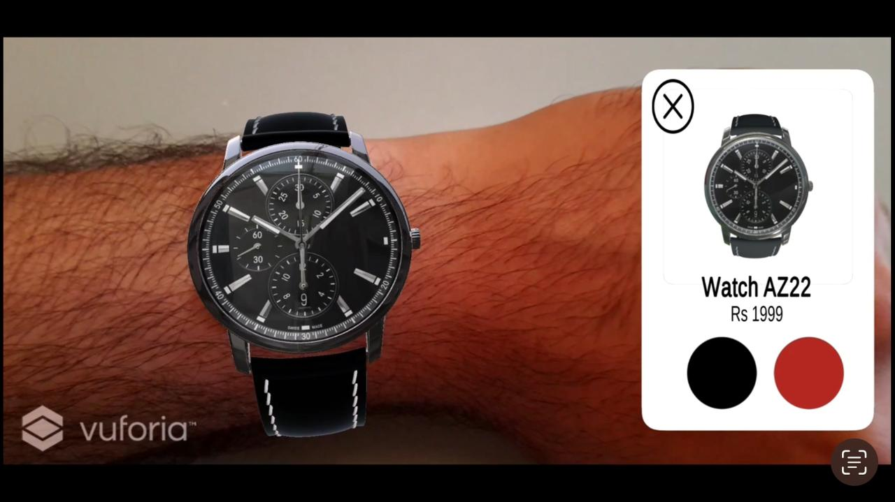
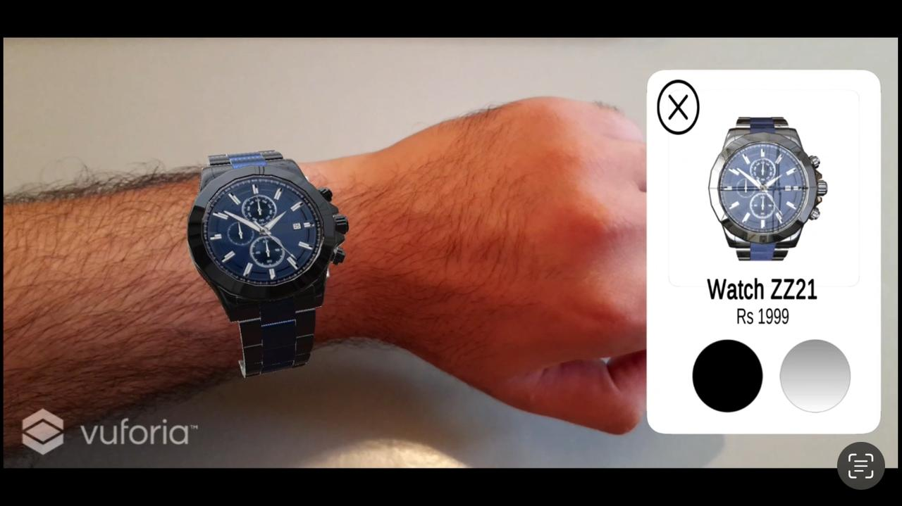

## Contexte du projet

Ce projet a été réalisé en 2024 dans le cadre de mon **projet de fin d’études de licence en Sciences Mathématiques et Informatiques**, à la Faculté des Sciences de Rabat. Il s’inscrit dans la thématique du **commerce mobile (M-commerce)**, avec une orientation forte vers l’innovation technologique par l’usage de la **réalité augmentée (AR)**.

L’application mobile développée, intitulée *Watches & Glasses*, permet aux utilisateurs d’essayer virtuellement des montres et des lunettes avant de les acheter en ligne. L’objectif était de **renforcer la confiance des clients** dans l’achat de produits à distance, tout en **réduisant le taux de retour** grâce à une visualisation précise et personnalisée des articles.

## Objectifs

- Concevoir une application mobile intuitive dédiée à la vente de montres et de lunettes.
- Intégrer une couche de réalité augmentée pour simuler l’essayage virtuel des produits.
- Mettre en place une **infrastructure de données sécurisée et réactive** via Firebase.
- Améliorer l’expérience utilisateur et la fiabilité du parcours d’achat.

## Technologies utilisées

- **Blender** : conception et optimisation des modèles 3D des montres et lunettes.
- **Unity** + **Vuforia** : intégration de la réalité augmentée pour permettre l’affichage en temps réel des produits sur l’utilisateur via caméra.
- **Android Studio** (Java, XML) : développement de l’interface mobile et des fonctionnalités natives.
- **Firebase** : gestion de la base de données en temps réel, **authentification des utilisateurs** et suivi analytique.
- **JSON** : format d’échange des données entre l’application et le back-end.

## Fonctionnalités développées

- Catalogue d’articles (montres, lunettes) avec images et informations détaillées.
- Essayage en réalité augmentée via caméra frontale (overlay dynamique des modèles 3D).
- Authentification et création de compte utilisateur avec Firebase Auth.
- Système de panier et simulation de commande.
- Enregistrement et suivi des actions utilisateur via Firebase Analytics.

## Résultat

L’application *Watches & Glasses* offre une interface fluide et moderne, combinant **visualisation immersive** et **fonctionnalités de commerce en ligne classiques**. Le rendu AR est stable et précis, et les tests ont montré une forte appréciation de l’expérience utilisateur en conditions réelles. Ce projet a été une **expérience fondatrice** dans ma formation, à la croisée de l’expérience utilisateur, du développement mobile et des technologies interactives.

## Visualisation

  
